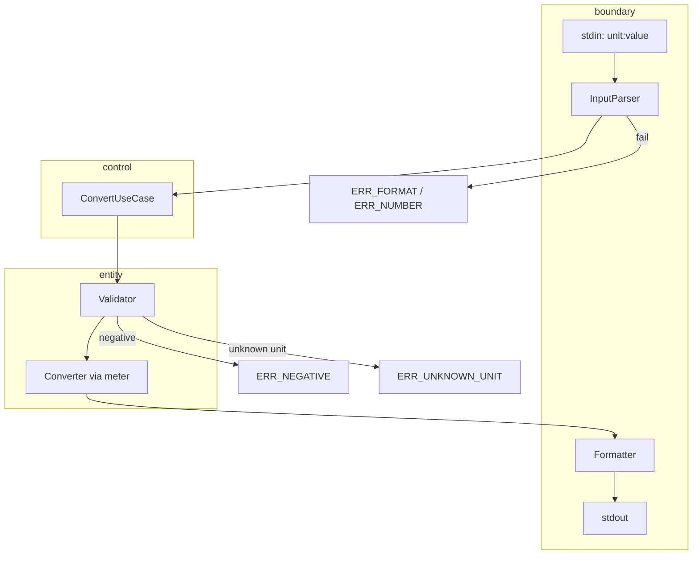

# 03 — Functional Spec (기능 명세)

## 1. 시스템 개요

UnitConverter_14는 사용자가 입력한 `단위:값`을 등록된 모든 길이 단위로 변환하여 CLI에 출력하는 프로그램이다.

```
[User Input]
      │
      ▼ boundary ── InputParser (unit:value)
      │
      ▼ control  ── ConvertUseCase
      │              ├── Validator (entity)
      │              └── Converter (entity, meter 경유)
      │
      ▼ boundary ── Formatter → stdout
```

**ECB 의존:** boundary → control → entity

---

## 2. 사용자 시나리오

### FS-01 기본 변환 (P0)

1. 사용자가 프로그램을 실행한다.
2. 프롬프트에 `meter:2.5`를 입력한다.
3. 시스템은 2.5 meter를 feet, yard로 변환하여 table 형식으로 출력한다.

**기대 출력 (table, 1자리):**
```
2.5 meter = 2.5 meter
2.5 meter = 8.2 feet
2.5 meter = 2.7 yard
```

### FS-02 feet 입력 변환 (P0)

1. 사용자가 `feet:8.2`를 입력한다.
2. meter, yard 포함 모든 등록 단위로 변환 출력.

### FS-03 yard 입력 변환 (P0)

1. 사용자가 `yard:2.7`를 입력한다.
2. meter, feet 포함 모든 등록 단위로 변환 출력.

### FS-04 오류 — 음수 (P0)

1. 사용자가 `meter:-1`을 입력한다.
2. 변환 없이 ERR_NEGATIVE 메시지 출력 후 종료(exit code 1).

### FS-05 오류 — 형식 (P0)

1. 사용자가 `meter2.5` 또는 `:2.5` 또는 `meter:` 를 입력한다.
2. ERR_FORMAT 또는 ERR_NUMBER 메시지 출력 후 종료.

### FS-06 오류 — 미등록 단위 (P0)

1. 사용자가 `mile:1`을 입력한다.
2. ERR_UNKNOWN_UNIT 메시지 출력 후 종료.

### FS-07 설정 파일 로드 (P2)

1. `--config units.json` 옵션으로 실행.
2. JSON에 정의된 단위·비율로 Registry 초기화.
3. 이후 FS-01과 동일 흐름.

### FS-08 cubit 동적 등록 (P2)

1. `--register "1 cubit = 0.4572 meter"` 옵션으로 실행.
2. Registry에 cubit 등록.
3. `cubit:1` 입력 시 meter, feet, yard, cubit 모두 출력.

### FS-09 JSON 출력 (P2)

1. `--format json` 옵션.
2. 변환 결과를 JSON 배열로 stdout 출력.

### FS-10 CSV 출력 (P2)

1. `--format csv` 옵션.
2. 헤더 + 데이터 행 CSV 출력.

---

## 3. CLI 인터페이스 (목표)

```
python UnitConverter.py [OPTIONS]

Options:
  --format {table,json,csv}   출력 포맷 (default: table)
  --config PATH               단위 설정 파일 (JSON/YAML)
  --register EXPR             동적 단위 등록 ("1 cubit = 0.4572 meter")
  -h, --help                  도움말
```

**SPEC 단계:** 위 CLI는 명세만 정의. 구현은 GREEN/new_features.

---

## 4. 처리 흐름 (ECB)



---

## 5. 컴포넌트 책임 (ECB)

| ECB | 컴포넌트 | Harness | 책임 | PRD |
|-----|----------|---------|------|-----|
| **boundary** | `CLI` | `boundary/cli.py` | argv, stdin, stdout, exit code | PRD-001, 015~017 |
| **boundary** | `InputParser` | `boundary/input_parser.py` | `unit:value` 분리 | PRD-006 |
| **boundary** | `Formatter` | `boundary/formatter/` | table/json/csv 렌더링 | PRD-008, 015~017 |
| **control** | `ConvertUseCase` | `control/convert_use_case.py` | 파싱→검증→변환 조율 | PRD-001 |
| **control** | `RegisterUnitUseCase` | `control/register_unit_use_case.py` | 동적 등록 흐름 [P2] | PRD-014 |
| **entity** | `Validator` | `entity/validator.py` | 숫자·음수·단위 검증 | PRD-005~007 |
| **entity** | `UnitRegistry` | `entity/registry.py` | 단위·비율 보관·조회 | PRD-002, 013, 014 |
| **entity** | `Converter` | `entity/converter.py` | meter 경유 변환 | PRD-003, 004 |
| **infrastructure** | `ConfigLoader` | `infrastructure/config_loader.py` | JSON/YAML 로드 | PRD-013 |
| **infrastructure** | `UnitRegistrar` | `infrastructure/unit_registrar.py` | 동적 등록 파싱 | PRD-014 |

상세: [08-design-spec.md](./08-design-spec.md)

---

## 6. Exit Code

| Code | 의미 |
|:----:|------|
| 0 | 정상 변환·출력 |
| 1 | 검증 오류 (VAL-*) |
| 2 | 설정/등록 오류 (CFG-*, REG-*) |
