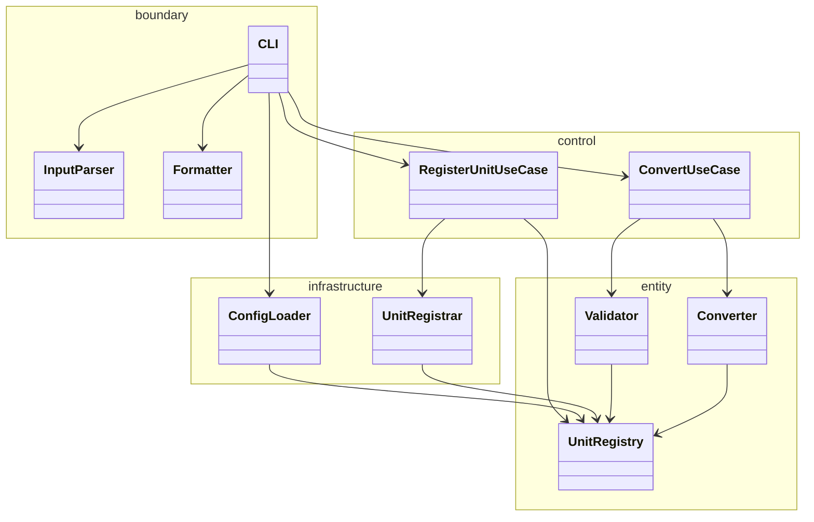

# 08 — Design Spec (ECB + OCP / SRP)

## 1. 설계 원칙

| 원칙 | 적용 |
|------|------|
| **ECB** | Entity–Control–Boundary. 의존 방향: **boundary → control → entity** |
| **SRP** | 레이어·클래스별 변경 이유 하나 |
| **OCP** | 확장(단위·포맷·설정)에 open, entity 변환 핵심에 closed |
| **DIP** | control은 entity 추상에 의존; entity는 boundary/infrastructure를 모름 |

### UnitConverter 가이드 → ECB 매핑

| 가이드 | ECB 레이어 | Harness |
|--------|------------|---------|
| **domain** — 변환·검증·단위 | **entity** | `src/unit_converter/entity/` |
| **app** — 유스케이스·흐름 | **control** | `src/unit_converter/control/` |
| CLI·포맷·입력 파싱 | **boundary** | `src/unit_converter/boundary/` |
| 설정·파일·동적 등록 | **infrastructure** | `src/unit_converter/infrastructure/` |

---

## 2. ECB 패키지 구조 (GREEN 이후)

```
src/unit_converter/
├── __init__.py
├── entity/                          # 도메인 — 순수 비즈니스 규칙
│   ├── __init__.py                  # (Harness: SPEC)
│   ├── unit.py                      # Unit, ConversionResult
│   ├── registry.py                  # UnitRegistry
│   ├── validator.py                 # Validator, ValidationError
│   └── converter.py                 # Converter (meter 경유)
├── control/                         # 유스케이스 — 흐름 조율
│   ├── __init__.py                  # (Harness: SPEC)
│   └── convert_use_case.py          # ConvertUseCase
│   └── register_unit_use_case.py    # RegisterUnitUseCase (P2)
├── boundary/                        # 외부 I/O · 표현
│   ├── __init__.py                  # (Harness: SPEC)
│   ├── cli.py                       # CLI 진입, argv, stdin/stdout
│   ├── input_parser.py              # InputParser — unit:value
│   └── formatter/
│       ├── __init__.py
│       ├── base.py                  # Formatter Protocol
│       ├── table.py
│       ├── json_fmt.py
│       └── csv_fmt.py
└── infrastructure/                  # 외부 자원 · 기술 세부
    ├── __init__.py                  # (Harness: SPEC)
    ├── config_loader.py             # ConfigLoader — JSON/YAML
    └── unit_registrar.py            # UnitRegistrar — 동적 등록

UnitConverter.py                       # thin wrapper → boundary.cli.main()

tests/
├── entity/                          # Track A: CONV, VAL
├── control/                         # Track A/B: UseCase 단위
└── boundary/                        # Track B: FMT, CLI, CFG, REG E2E
```

**SPEC:** Harness(`__init__.py`)만 존재. `src/unit_converter/__init__.py`는 **GREEN** 시 생성 (NFR-004 `python -m unit_converter`).

---

## 3. 레이어 의존 규칙

```
[ User / stdin / argv / config file ]
              │
              ▼
         boundary  ──►  control  ──►  entity
              │            │
              │            └── infrastructure (Registry 구성)
              └── formatter, CLI (stdout)
```

| From → To | 허용 |
|-----------|:----:|
| boundary → control | ✓ |
| control → entity | ✓ |
| control → infrastructure | ✓ |
| control → boundary | ✗ |
| entity → boundary | ✗ |
| entity → infrastructure | ✗ |
| entity → control | ✗ |

---

## 4. 컴포넌트 상세 (ECB별)

### 4.1 entity — 도메인

#### UnitRegistry (`entity/registry.py`)

```python
@dataclass
class Unit:
    name: str
    to_meter_factor: float

class UnitRegistry:
    def register(self, unit: Unit) -> None: ...
    def get(self, name: str) -> Unit: ...
    def all_units(self) -> list[Unit]: ...
    def has(self, name: str) -> bool: ...
```

- **PRD:** PRD-002, 013, 014 | **Test:** VAL-03, CFG-01, REG-01

#### Validator (`entity/validator.py`)

```python
class ValidationError(Exception):
    code: str  # ERR_*

class Validator:
    def validate(self, unit: str, value: float, registry: UnitRegistry) -> float: ...
```

- **PRD:** PRD-005~007 | **Test:** VAL-*

#### Converter (`entity/converter.py`)

```python
class Converter:
    def convert_all(self, unit: str, value: float, registry: UnitRegistry) -> list[ConversionResult]: ...
```

- **내부:** `_to_meters`, `_from_meters` — feet↔yard **직접 상수 금지**
- **PRD:** PRD-003, 004, 009 | **Test:** CONV-*

---

### 4.2 control — 유스케이스

#### ConvertUseCase (`control/convert_use_case.py`)

```python
class ConvertUseCase:
    def execute(
        self, unit: str, value: float, registry: UnitRegistry
    ) -> list[ConversionResult]:
        # Validator → Converter (파싱은 boundary.CLI + InputParser에서 완료)
```

- **입력:** CLI(boundary)가 `InputParser`로 파싱한 `unit`, `value`만 전달 — control은 boundary를 **import하지 않음**
- **PRD:** PRD-001 | **Test:** CONV-* (control 단위), CLI-02 (E2E)

#### RegisterUnitUseCase (`control/register_unit_use_case.py`) [P2]

- infrastructure.UnitRegistrar 결과를 Registry에 반영
- **PRD:** PRD-014 | **Test:** REG-*

---

### 4.3 boundary — I/O · 표현

#### InputParser (`boundary/input_parser.py`)

```python
@dataclass
class ParsedInput:
    unit: str
    value: float  # 파싱·float 변환 완료 값

class ParseError(Exception):
    code: str  # ERR_FORMAT | ERR_NUMBER

class InputParser:
    def parse(self, raw: str) -> ParsedInput: ...  # 실패 시 ParseError
```

- 형식·숫자 검증은 **boundary**에서 완료. entity.Validator는 음수·미등록 단위만 담당.
- **PRD:** PRD-006 | **Test:** VAL-02, VAL-02b, VAL-04 (`tests/boundary/test_input_parser.py`)

#### CLI (`boundary/cli.py`)

```python
def main(argv: list[str] | None = None) -> int: ...
```

- 흐름: stdin → `InputParser.parse` → `ConvertUseCase.execute(unit, value, registry)` → `Formatter` → stdout
- `ParseError` / `ValidationError` → stderr 메시지 + exit code
- **PRD:** PRD-001, 015~017 | **Test:** CLI-*

#### Formatter (`boundary/formatter/`)

```python
class Formatter(Protocol):
    def format(self, results: list[ConversionResult]) -> str: ...
```

- Table / Json / Csv — **OCP:** 새 포맷 = 새 클래스, entity 수정 없음
- **PRD:** PRD-008, 015~017 | **Test:** FMT-*

---

### 4.4 infrastructure — 외부 자원

| 클래스 | 파일 | SRP |
|--------|------|-----|
| ConfigLoader | `infrastructure/config_loader.py` | 파일 → UnitRegistry |
| UnitRegistrar | `infrastructure/unit_registrar.py` | 등록 문자열 → Unit |

- **PRD:** PRD-013, 014 | **Test:** CFG-*, REG-*
- control이 infrastructure를 호출해 Registry를 **구성**; entity는 결과 Registry만 받음

---

## 5. 확장 시나리오 (OCP)

| 확장 | 변경 | 불변 (entity) |
|------|------|---------------|
| inch 단위 | units.json, ConfigLoader | Converter, Validator |
| xml 포맷 | boundary/formatter/xml.py | Converter, Validator |
| cubit 등록 | UnitRegistrar | Converter |

---

## 6. UnitConverter.py

GREEN MVP 후 `UnitConverter.py` → `boundary.cli.main()` 위임. REFACTOR에서 ECB 레이어 정렬.

---

## 7. ECB 클래스 다이어그램


