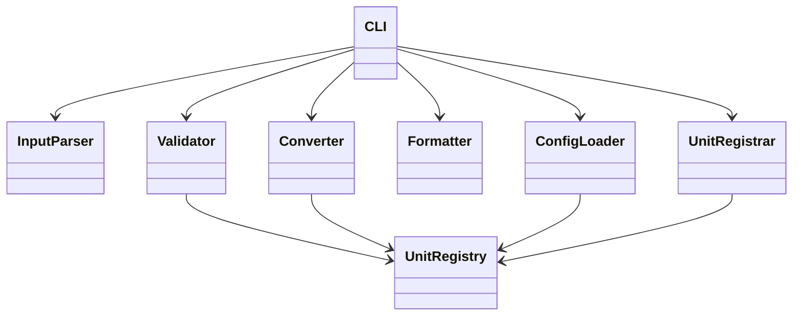

# 08 — Design Spec (OCP / SRP 설계 명세)

## 1. 설계 원칙

| 원칙 | 적용 |
|------|------|
| **SRP** | 한 클래스 = 한 변경 이유 |
| **OCP** | 확장(단위·포맷·설정)에 open, Converter 핵심에 closed |
| **DIP** | Converter는 Registry·Formatter **인터페이스**에 의존 |

---

## 2. 목표 패키지 구조 (GREEN 이후)

```
unit_converter/
├── __init__.py
├── cli.py                 # CLI 진입, argv, stdin/stdout
├── parser.py              # InputParser — unit:value 분리
├── validator.py           # Validator — VAL-R01~04
├── registry.py            # UnitRegistry — 단위·비율
├── converter.py           # Converter — meter 경유 변환
├── formatter/
│   ├── __init__.py
│   ├── base.py            # Formatter Protocol
│   ├── table.py
│   ├── json_fmt.py
│   └── csv_fmt.py
├── config_loader.py       # ConfigLoader — JSON/YAML
└── registrar.py           # UnitRegistrar — 동적 등록

UnitConverter.py           # thin wrapper → cli.main()
tests/
├── track_a/               # Domain: CONV, VAL
└── track_b/               # Integration: FMT, CFG, REG, CLI
```

**SPEC:** 구조·이름만 정의. 디렉터리 생성은 GREEN.

---

## 3. 컴포넌트 상세

### 3.1 InputParser (SRP: 문자열 → 구조)

```python
@dataclass
class ParsedInput:
    unit: str
    value_str: str

class InputParser:
    def parse(self, raw: str) -> ParsedInput: ...
```

- 변경 이유: 입력 문법 변경
- **PRD:** PRD-006 | **Test:** VAL-02

---

### 3.2 Validator (SRP: 비즈니스 규칙 검증)

```python
class ValidationError(Exception):
    code: str  # ERR_*
    message: str

class Validator:
    def validate(self, parsed: ParsedInput, registry: UnitRegistry) -> float: ...
```

- 변경 이유: 검증 규칙 추가/변경
- **PRD:** PRD-005~007 | **Test:** VAL-*

---

### 3.3 UnitRegistry (SRP: 단위 메타데이터)

```python
@dataclass
class Unit:
    name: str
    to_meter_factor: float

class UnitRegistry:
    def register(self, unit: Unit) -> None: ...
    def get(self, name: str) -> Unit: ...
    def all_units(self) -> list[Unit]: ...
    def has(self, name: str) -> bool: ...
```

- 변경 이유: 단위 저장·조회 방식
- **PRD:** PRD-002, 013, 014 | **Test:** VAL-03, CFG-01, REG-01

---

### 3.4 Converter (SRP: meter 경유 변환)

```python
@dataclass
class ConversionResult:
    input_unit: str
    input_value: float
    target_unit: str
    target_value: float  # rounded display

class Converter:
    def convert_all(self, unit: str, value: float, registry: UnitRegistry) -> list[ConversionResult]: ...
```

- **내부:** `_to_meters`, `_from_meters` private
- 변경 이유: 변환 알고리즘 (base unit 변경 시에만)
- **금지:** feet↔yard 직접 상수
- **PRD:** PRD-003, 004 | **Test:** CONV-*

---

### 3.5 Formatter (OCP: Strategy)

```python
class Formatter(Protocol):
    def format(self, results: list[ConversionResult]) -> str: ...

class TableFormatter(Formatter): ...
class JsonFormatter(Formatter): ...
class CsvFormatter(Formatter): ...
```

- 새 포맷 = 새 Formatter 클래스 + CLI registry 등록
- Converter **수정 없음**
- **PRD:** PRD-008, 015~017 | **Test:** FMT-*

---

### 3.6 ConfigLoader / UnitRegistrar

| 클래스 | SRP | OCP |
|--------|-----|-----|
| ConfigLoader | 파일 → Registry | 새 Loader 추가 |
| UnitRegistrar | 등록 문자열 → Unit | 패턴 확장 시만 수정 |

---

### 3.7 CLI (SRP: 오케스트레이션)

```python
def main(argv: list[str] | None = None) -> int:
    # parse args → build registry → read stdin → validate → convert → format → print
```

- 변경 이유: UX·옵션·exit code
- **Test:** CLI-* (Track B)

---

## 4. 확장 시나리오 (OCP 검증)

| 확장 | 변경 파일 | 불변 파일 |
|------|-----------|-----------|
| inch 단위 추가 | units.json, (선택) ConfigLoader | Converter |
| xml 포맷 | formatter/xml.py, cli format map | Converter, Validator |
| cubit 등록 | UnitRegistrar (이미 존재) | Converter |

---

## 5. 기존 UnitConverter.py와의 관계

현재 프로토타입은 **GREEN MVP 후** `UnitConverter.py` → `cli.main()` 위임으로 대체. REFACTOR에서 SRP 분리 완료.

---

## 6. 인터페이스 다이어그램


