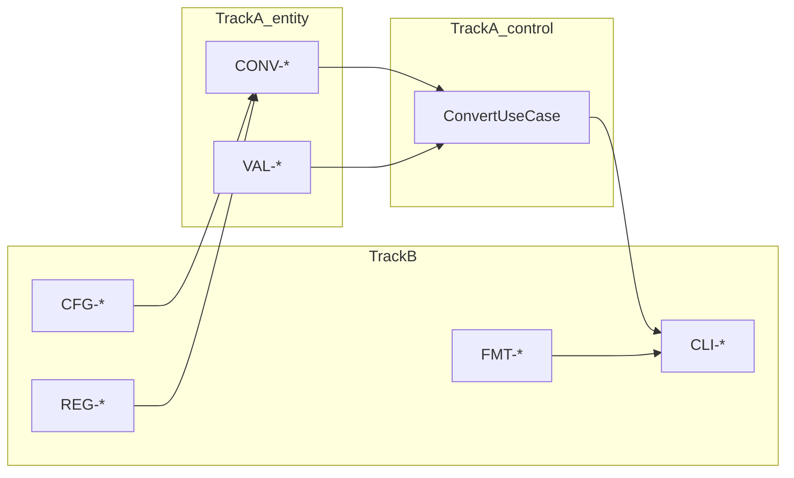

# 10 — Dual-Track TDD Plan (ECB)

## 1. 개요

Dual-Track TDD는 **Track A(entity/control)** 와 **Track B(boundary + E2E)** 를 분리한다. Mom Test "수동 재검증"은 Track A에서 먼저 고정하고, Track B에서 CLI·포맷 관점을 검증한다.

**ECB 테스트 Harness (SPEC):**

| Track | ECB 레이어 | Harness 경로 |
|-------|------------|--------------|
| A — Domain | entity, control | `tests/entity/`, `tests/control/` |
| B — Integration | boundary, control(E2E) | `tests/boundary/` |

---

## 2. Track 정의

| Track | 범위 | Test 접두 | ECB | CODE-REF |
|-------|------|-----------|-----|----------|
| **A — Domain** | 변환, meter 경유, 검증 | CONV-*, VAL-* | entity | `entity.converter`, `entity.validator`, `entity.registry` |
| **A — UseCase** | 유스케이스 조율 | CONV-*, CLI-02 (unit) | control | `control.convert_use_case` |
| **B — Integration** | CLI, 포맷, 설정, E2E | FMT-*, CFG-*, REG-*, CLI-* | boundary, infrastructure | `boundary.cli`, `boundary.formatter`, `infrastructure.*` |

---

## 3. RED 사이클 순서

### Cycle 1 — MVP entity (red → green, P0)

```
RED:   CONV-01 → CONV-04 → VAL-01 → VAL-02 → VAL-03 → VAL-04 → VAL-05
       tests/entity/
GREEN: entity/converter, validator, registry (최소)
REFACTOR: entity 모듈 SRP 정리
```

### Cycle 1b — control (red → green, P0)

```
RED:   ConvertUseCase (CONV + VAL 통합)
       tests/control/
GREEN: control/convert_use_case.py
```

### Cycle 2 — boundary CLI + table (red → green, P0)

```
RED:   FMT-01 → CLI-02
       tests/boundary/
GREEN: boundary/cli, boundary/formatter/table, InputParser
REFACTOR: Formatter Protocol (boundary/formatter/base)
```

### Cycle 3 — infrastructure Config (new_features, P2)

```
RED:   CFG-01 → CFG-02
GREEN: infrastructure/config_loader + units.json
```

### Cycle 4 — infrastructure Registration (new_features, P2)

```
RED:   REG-01 → REG-02 → CONV-05
GREEN: infrastructure/unit_registrar, control/register_unit_use_case
```

### Cycle 5 — boundary Formats (new_features, P2)

```
RED:   FMT-02 → FMT-03
GREEN: boundary/formatter/json_fmt, csv_fmt
```

---

## 4. 의존관계



- Track B는 Track A(entity + control)에 **의존**
- RED Cycle 1~2 완료 전 Cycle 3~5 착수 금지

---

## 5. 테스트 디렉터리 (RED에서 생성)

```
tests/
├── entity/
│   test_converter.py      # CONV-*
│   test_validator.py      # VAL-*
│   test_registry.py       # (필요 시)
├── control/
│   test_convert_use_case.py
├── boundary/
│   test_cli.py            # CLI-*
│   test_formatters.py     # FMT-*
│   test_config.py         # CFG-* (infrastructure + E2E)
│   test_registration.py   # REG-*
└── conftest.py            # default registry fixture
```

---

## 6. ARRR ↔ Track ↔ ECB

| ARRR | 브랜치 | Track | ECB |
|------|--------|-------|-----|
| Ask | red | A | entity → control |
| Ask | red | B | boundary |
| Respond | green | 동일 | 해당 레이어 최소 구현 |
| Refine | refactoring | A+B | ECB 의존 방향 검증 |
| Repeat | spec → red | — | P2 PRD 반영 |

---

## 7. Mom Test 대응

| Mom Test | Track | ECB | Test |
|----------|-------|-----|------|
| 40분 상수 불일치 | A | entity | CONV-04 |
| 형식 검증 누락 | A | entity + boundary | VAL-02, VAL-04 |
| 1시간 수동 비교표 | A+B | 전 레이어 | pytest 회귀 |

---

## 8. RED 착수 체크리스트

- [ ] 09-scenario-catalog P0 시나리오 확정
- [ ] 08-design-spec ECB 레이어·의존 방향 확정
- [ ] 11-traceability-matrix CODE-REF ECB 경로
- [ ] Harness: `tests/entity`, `tests/control`, `tests/boundary`
- [ ] spec → red 브랜치 merge
