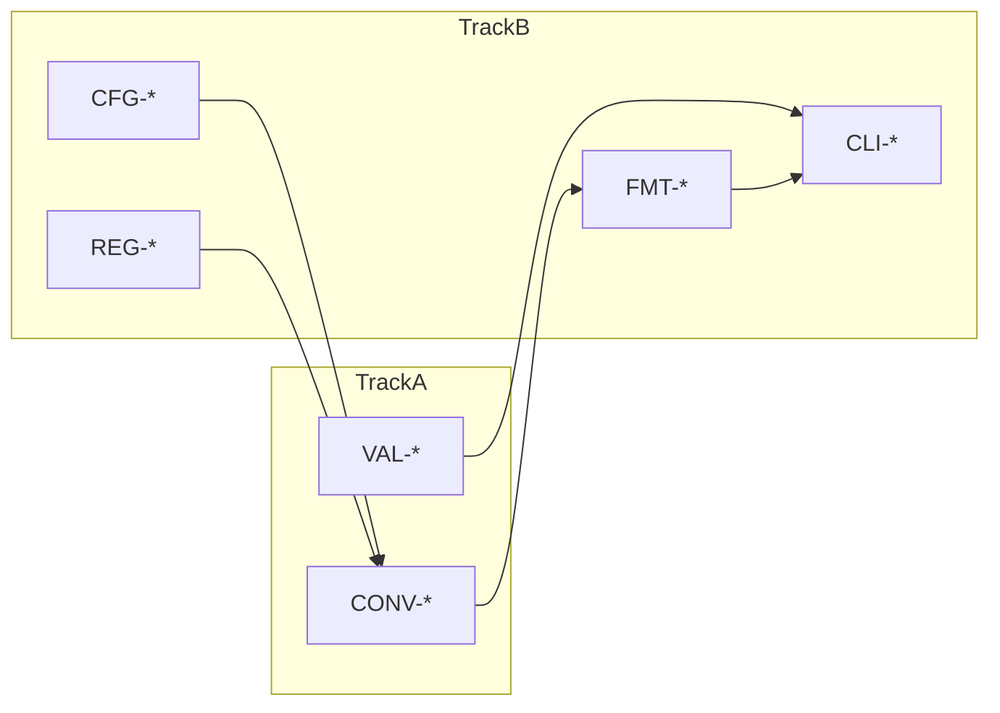

# 10 — Dual-Track TDD Plan

## 1. 개요

Dual-Track TDD는 **도메인 로직(Track A)** 과 **통합·CLI(Track B)** 테스트를 분리하여, Mom Test "수동 재검증"을 Track A에서 먼저 고정하고 Track B에서 사용자 관점을 검증한다.

---

## 2. Track 정의

| Track | 범위 | Test 접두 | CODE-REF |
|-------|------|-----------|----------|
| **A — Domain** | 변환 정확성, meter 경유, 입력 검증 | CONV-*, VAL-* | Converter, Validator, UnitRegistry, InputParser |
| **B — Integration** | CLI, 포맷, 설정, 등록, E2E | FMT-*, CFG-*, REG-*, CLI-* | CLI, Formatter, ConfigLoader, UnitRegistrar |

---

## 3. RED 사이클 순서

### Cycle 1 — MVP Domain (red → green, P0)

```
RED:   CONV-01 → CONV-04 → VAL-01 → VAL-02 → VAL-03 → VAL-04 → VAL-05
GREEN: Converter + Validator + Registry (최소)
REFACTOR: SRP 분리 (parser, validator, converter)
```

### Cycle 2 — CLI Table (red → green, P0)

```
RED:   FMT-01 → CLI-02
GREEN: CLI + TableFormatter
REFACTOR: Formatter Protocol 추출
```

### Cycle 3 — Config (new_features, P2)

```
RED:   CFG-01 → CFG-02
GREEN: ConfigLoader + units.json
```

### Cycle 4 — Registration (new_features, P2)

```
RED:   REG-01 → REG-02 → CONV-05
GREEN: UnitRegistrar
```

### Cycle 5 — Formats (new_features, P2)

```
RED:   FMT-02 → FMT-03
GREEN: JsonFormatter, CsvFormatter
```

---

## 4. 의존관계



- Track B는 Track A 컴포넌트에 **의존**
- RED Cycle 1~2 완료 전 Cycle 3~5 착수 금지

---

## 5. 테스트 디렉터리 (RED에서 생성)

```
tests/
├── track_a/
│   test_converter.py      # CONV-*
│   test_validator.py      # VAL-*
│   test_registry.py       # (필요 시)
├── track_b/
│   test_cli.py            # CLI-*
│   test_formatters.py     # FMT-*
│   test_config.py         # CFG-*
│   test_registration.py   # REG-*
└── conftest.py            # default registry fixture
```

---

## 6. ARRR ↔ Track 매핑

| ARRR | 브랜치 | Track | 활동 |
|------|--------|-------|------|
| Ask | red | A 또는 B | 실패 테스트 추가 |
| Respond | green | 동일 | 최소 구현 |
| Refine | refactoring | A+B | 구조 정리, 테스트 green 유지 |
| Repeat | spec 갱신 → red | — | P2 시나리오 PRD 반영 후 Cycle 3~ |

---

## 7. Mom Test 대응

| Mom Test | Track | Test |
|----------|-------|------|
| 40분 상수 불일치 | A | CONV-04 |
| 형식 검증 누락 | A | VAL-02, VAL-04 |
| 1시간 수동 비교표 | A+B | 전체 pytest 회귀 |

---

## 8. RED 착수 체크리스트

- [ ] 09-scenario-catalog P0 시나리오 확정
- [ ] 11-traceability-matrix PRD↔Test 연결
- [ ] 06-conversion-rules Golden Values 확정
- [ ] spec → red 브랜치 merge
